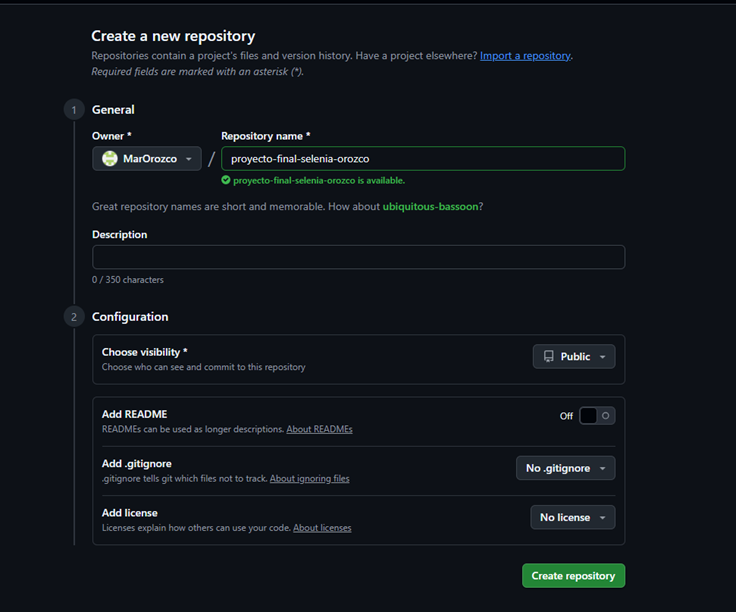
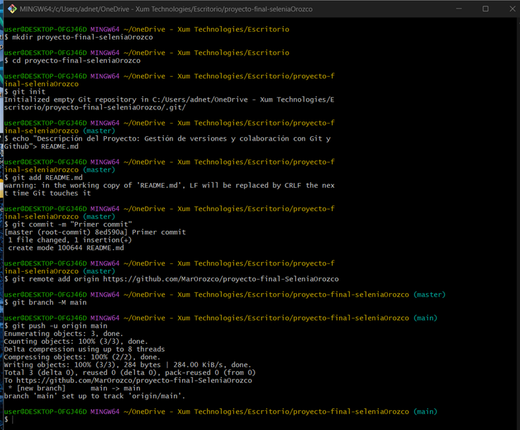
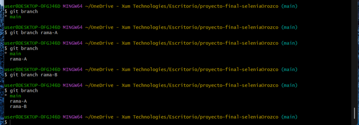
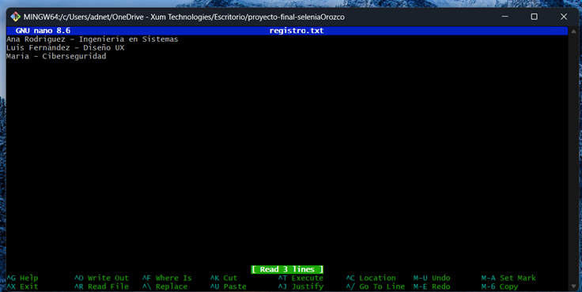
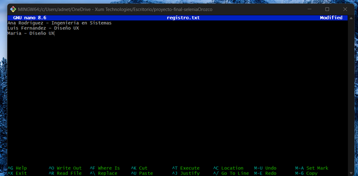
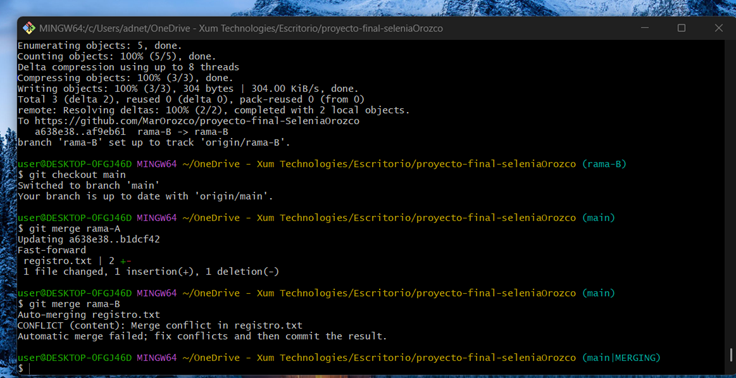
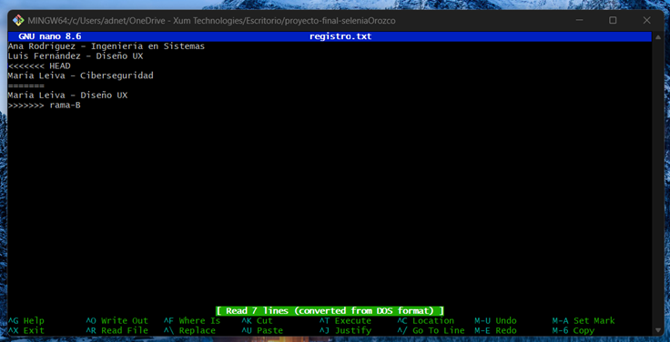
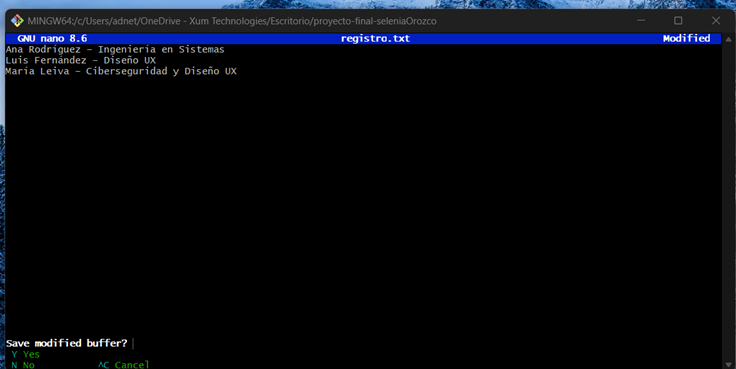
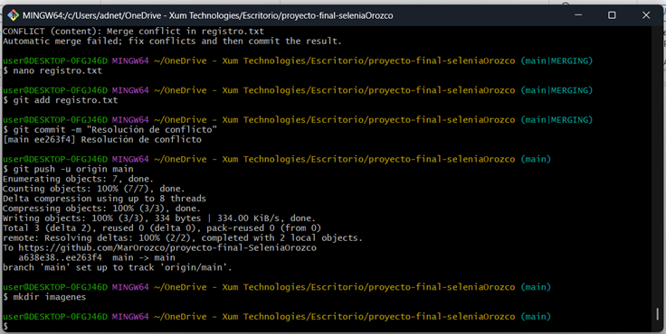

# 1. Titulo: Proyecto Final – Uso de Ramas y Resolución de Conflictos en Git

## 2. Descripción del Proyecto
Este proyecto tiene como objetivo aplicar los conocimientos sobre control de versiones utilizando Git y GitHub, a través de la creación de ramas, modificación de archivos y resolución de conflictos, se demuestra cómo se gestiona un flujo de trabajo colaborativo en entornos de desarrollo.  
El proyecto incluye la manipulación de archivos como `datos.xlsx` y `registro.txt`, así como la documentación del proceso mediante Markdown y la inclusión de capturas de pantalla.


## 3. Nombre:

Selenia del Mar Orozco González**


## 4. Comandos utilizados

A continuación se listan algunos de los comandos empleados durante el desarrollo del proyecto:

```bash
# Crear un nuevo repositorio
git init

# Agregar archivos al área de preparación
git add .

# Realizar un commit con mensaje
git commit -m "Primer commit"

# Crear ramas
git branch rama-A
git branch rama-B

# Cambiar de rama
git checkout rama-A

# Fusionar ramas
git merge rama-A
git merge rama-B

# Ver estado de los archivos
git status

# Subir cambios al repositorio remoto
git push origin main

## 5. Capturas del proceso











## 6. Reflexión final

Trabajar con Git y Github me permitió comprender mejor la importancia de llevar un control estructurado de los cambios en un proyecto. Durante el proceso aprendí que las ramas facilitan el trabajo colaborativo sin afectar código o documentos estables y luego identificar si hay conflictos o varios cambios a un mismo contenido. Permite mantener el código limpio y organizado evitando que agregar nuevas funcionales impacten en lo existente.
Además del uso de agregar diferentes tipos de documentos y el poder subir imágenes facilitando la documentación de los procesos realizados. En conclusión esta práctica reforzó mis habilidades para trabajar en equipo, mantener el orden por el versionamiento, identificar cambios y aplicar buenas prácticas al resolver conflictos.

## 7. Lecciones aprendidas


- Aprendí a crear, fusionar y eliminar ramas de manera controlada.

- Comprendí cómo identificar y resolver conflictos de manera manual.

- Entendí el valor de mantener mensajes de commit claros y coherentes.

- Descubrí la utilidad del archivo README.md para documentar todo el proceso.

- Recomiendo realizar commits frecuentes y trabajar con ramas separadas para cada funcionalidad.

- Mantener una buena organización de archivos e imágenes mejora la claridad del proyecto.

- Finalmente, practicar constantemente con Git fortalece la confianza al usarlo en proyectos reales.
